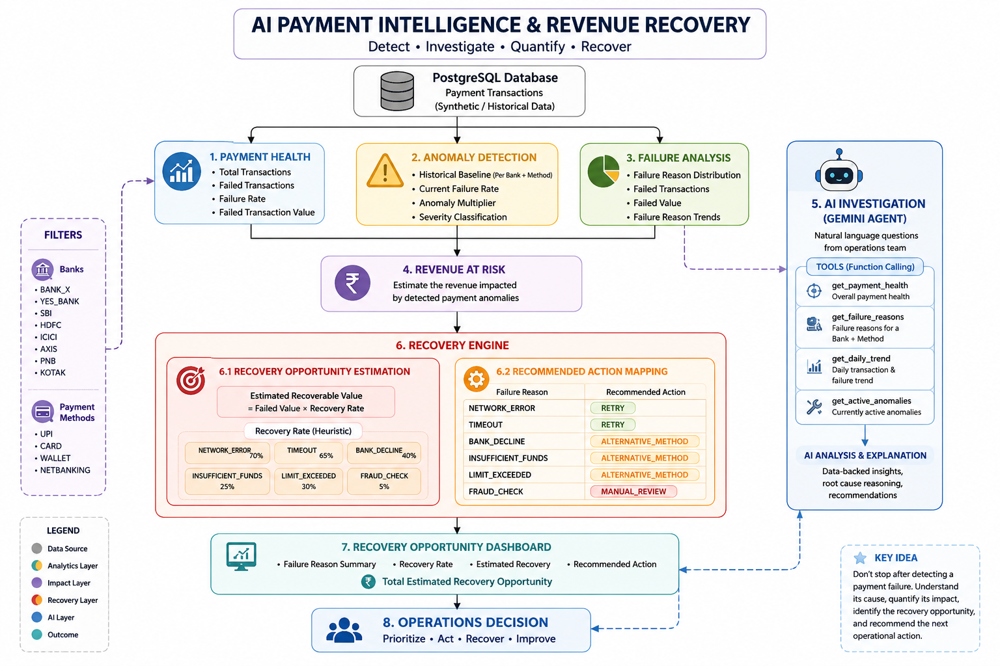

```text
#  AI Payment Intelligence & Revenue Recovery

> An AI-powered payment operations system that detects payment anomalies, investigates their root causes, estimates revenue at risk, and identifies actionable recovery opportunities.

Built for the **Razorpay AI Buildathon 2026**.

---

## Problem

Payment failures are not simply a matter of counting unsuccessful transactions.

For a payment operations team, a sudden increase in failures raises several important questions:

- Which bank or payment method is affected?
- Is the failure rate actually abnormal?
- How far has it moved away from the normal baseline?
- What are the dominant failure reasons?
- How much transaction value is at risk?
- Which failures can potentially be recovered?
- What action should the operations team take?
- Which failures should be retried, redirected, or manually reviewed?

Traditional dashboards can show transaction counts and failure percentages, but they often stop at "what happened."

The goal of this project is to move from:

> **Detection → Investigation → Revenue Impact → Recovery Action**

---

## Buildathon Track

### AI Revenue Recovery

This project is aligned with Razorpay's **AI Revenue Recovery** track.

The system focuses on payment degradation:


Payment failures
      ↓
Detect abnormal behaviour
      ↓
Identify affected bank / payment method
      ↓
Analyze failure reasons
      ↓
Estimate revenue at risk
      ↓
Estimate recovery opportunity
      ↓
Recommend bounded recovery actions
      ↓
AI explains the investigation

 Daily Payment Failure Trend

The application displays a daily failure-rate trend.

This helps identify:

Sudden spikes
Increasing failure rates
Periods of instability
Changes in payment behaviour

Instead of looking only at one aggregate number, operations teams can observe how payment reliability changes over time.

Automated Anomaly Detection

One of the core components is automated anomaly detection.

Instead of using only an arbitrary fixed failure-rate threshold, the system compares the current failure rate against a historical baseline for each:

Bank + Payment Method

The system calculates:

Current Failure Rate
Historical Baseline
Anomaly Multiplier
Severity
Estimated Revenue at Risk
Example

A payment combination may have:

Current failure rate: 34.62%
Historical baseline:   7.86%

This represents a significant degradation in payment performance.

The system then classifies the incident based on its severity.

 Active Payment Incidents

Detected anomalies are displayed as active payment incidents.

Each incident provides:

Severity
Bank
Payment method
Current failure rate
Historical baseline
Anomaly multiplier
Estimated revenue at risk

Users can then investigate the incident using the AI Payment Analyst.

🤖 AI Payment Analyst

The application includes a Gemini-powered AI analyst.

Users can ask questions such as:

Why is BANK_X UPI failing?

or:

What payment anomalies are currently active?

The AI does not simply generate an answer from its own knowledge.

Instead, it can call application tools that retrieve information from the PostgreSQL database.

AI Tool Calling

The agent has access to tools for:

get_payment_health

Retrieves:

Total transactions
Failed transactions
Failure rate
Failed transaction value
get_failure_reasons

Retrieves failure information for a:

Bank + Payment Method

combination.

get_daily_trend

Retrieves daily transaction and failure trends.

get_active_anomalies

Retrieves currently active payment anomalies.

AI Investigation Flow
User asks a question
        ↓
Gemini receives the question
        ↓
Determines whether database information is required
        ↓
Calls the appropriate tool
        ↓
Tool queries PostgreSQL
        ↓
Database result returned to Gemini
        ↓
Gemini analyzes the evidence
        ↓
Natural-language investigation

The AI is explicitly instructed to:

1)-Use tools when transaction data is required.
2)-Never invent metrics.
3)-Treat database results as the source of truth.
Explain reasoning.
4)-Distinguish facts from recommendations.
5)-Avoid claiming unsupported root causes.
6)-State when evidence is insufficient.

This makes the AI output more grounded in the actual payment data.

 Revenue at Risk

Detecting an anomaly is only useful if its business impact can be understood.

The system estimates:

Revenue at Risk

for detected payment incidents.

This allows the operations team to prioritize incidents based not only on failure rate, but also on their potential financial impact.

🔎 Failure Reason Analysis

Once an incident is selected, the application analyzes its failure reasons.

Example failure reasons include:

BANK_DECLINE
INSUFFICIENT_FUNDS
NETWORK_ERROR
TIMEOUT
LIMIT_EXCEEDED
FRAUD_CHECK

For each failure reason, the system can display:

Failed transactions
Percentage of total failures
Failed transaction value
Recovery rate
Estimated recoverable value
Recommended recovery action
♻️ Recovery Opportunity Engine

This was added to move the project beyond simply detecting payment failures.

The recovery engine evaluates each failure reason and estimates how much of the failed transaction value could potentially be recovered.

The calculation is:

Estimated Recoverable Value
=
Failed Transaction Value × Estimated Recovery Rate

The recovery rates are currently heuristic assumptions used for the prototype.

For example:

NETWORK_ERROR       → 70%
TIMEOUT             → 65%
BANK_DECLINE        → 40%
INSUFFICIENT_FUNDS  → 25%
LIMIT_EXCEEDED      → 30%
FRAUD_CHECK         → 5%

These values are not claimed to represent guaranteed recovery.

They are used to demonstrate how a recovery-prioritization layer can work.

🧭 Recovery Actions

The system maps failure reasons to bounded recommended actions.

Failure Reason	Recommended Action
NETWORK_ERROR	RETRY
TIMEOUT	RETRY
BANK_DECLINE	ALTERNATIVE_METHOD
INSUFFICIENT_FUNDS	ALTERNATIVE_METHOD
LIMIT_EXCEEDED	ALTERNATIVE_METHOD
FRAUD_CHECK	MANUAL_REVIEW
Why deterministic actions?

The recovery action is intentionally handled by deterministic application logic rather than allowing the LLM to freely invent an action.

The AI is useful for:

Investigation
Reasoning
Explanation

while the recovery mapping provides predictable operational behaviour.

📊 Recovery Opportunity Dashboard

The dashboard summarizes recovery opportunities by failure reason.

It displays:

Failure reason
Failed transactions
Percentage of total failures
Failed value
Recovery rate
Estimated recovery
Recommended action

It also calculates:

Total Estimated Recovery Opportunity

across the analyzed failure categories.

This allows the operations team to prioritize the largest recovery opportunities first.

 Example Investigation

For a BANK_X / UPI incident, the system can identify:

Current failure rate: 34.62%
Baseline:              7.86%

and identify the major failure contributors:

BANK_DECLINE
INSUFFICIENT_FUNDS
NETWORK_ERROR
TIMEOUT
FRAUD_CHECK
LIMIT_EXCEEDED

The recovery engine then estimates the potential recovery opportunity for each category.

For example:

BANK_DECLINE
→ Alternative payment method

NETWORK_ERROR
→ Retry

TIMEOUT
→ Retry

INSUFFICIENT_FUNDS
→ Alternative payment method

LIMIT_EXCEEDED
→ Alternative payment method

FRAUD_CHECK
→ Manual review

The important distinction is:

Revenue at risk is not the same as recoverable revenue.

The system therefore presents recovery estimates as heuristic opportunities rather than guaranteed recovered revenue.

🛠️ Why I Built It This Way
Change 1 — Added anomaly detection

A raw failure percentage is not enough.

A 10% failure rate may be normal for one payment combination but highly abnormal for another.

Therefore, we introduced historical baselines and anomaly multipliers.

Change 2 — Added AI investigation

Traditional dashboards require an operations engineer to manually inspect multiple tables and metrics.

We added a Gemini-powered analyst so an operator can ask:

Why is BANK_X UPI failing?

and receive a data-backed explanation.

Change 3 — Added database tool calling

We did not want the LLM to answer payment questions using unsupported assumptions.

The agent can therefore call tools that retrieve real transaction information from PostgreSQL.

Change 4 — Added revenue-at-risk estimation

Failure counts alone don't communicate business impact.

Two incidents with the same number of failed transactions can have very different financial consequences.

Therefore, failed transaction value is included in anomaly analysis.

Change 5 — Added recovery actions

The project originally focused primarily on identifying and investigating failures.

I extended it into a recovery-oriented system by mapping failure reasons to practical actions:

Retry
Alternative Method
Manual Review
Investigate
Change 6 — Added recovery opportunity estimation

I wanted to answer a more important business question:

"After finding the failures, where should the operations team focus first?"

Therefore, the system estimates recoverable value for each failure reason.

Change 7 — Added recovery prioritization

Instead of treating every failure equally, the dashboard allows the team to identify the failure categories with the largest potential recovery opportunity.

This turns the system from a monitoring dashboard into a basic recovery prioritization layer.

⚠️ Challenges Faced
1. PostgreSQL integration

The project required connecting the application to a PostgreSQL database and ensuring that the analytics queries returned usable results for the dashboard.

2. Designing useful failure analytics

Simply counting failures was not enough.

I needed to calculate:

Failure rates
Historical baselines
Failure-reason distributions
Failed transaction values
Revenue impact
3. AI grounding

One of the major challenges was preventing the AI from making unsupported claims.

I addressed this by giving Gemini database tools and explicitly instructing it to treat database results as the source of truth.

4. Recovery estimation

Actual recovery probability depends on many real-world factors.

Therefore, the prototype uses heuristic recovery rates rather than claiming that the estimated amount will definitely be recovered.

5. Keeping recovery decisions predictable

An LLM can produce different responses to the same situation.

For operational payment recovery, completely open-ended actions would be risky.

Therefore, recovery actions are mapped through deterministic application logic.

6. Debugging Python module imports

During development, the recovery module initially produced an import error when the application attempted to import:

build_recovery_opportunities

The implementation was corrected and stale Python cache files were removed so the updated module was loaded correctly.

7. Keeping the dashboard readable

As more recovery information was added, the dashboard initially contained duplicated analysis tables and overlapping visualizations.

I reorganized the recovery section so the final dashboard presents the recovery opportunity information more clearly.

🧰 Tech Stack
Frontend / Dashboard
Streamlit
Programming
Python
Database
PostgreSQL
Data Analysis
Pandas
SQL
AI
Google Gemini
Gemini 2.5 Flash
Function / tool calling
Configuration
python-dotenv
Version Control
Git
GitHub

🚀 Running the Project
1. Clone the repository
git clone https://github.com/joshikarthikeyan4-pixel/Razorpay_ai-buildathon.git
cd Razorpay_ai-buildathon
2. Install dependencies
pip install -r requirements.txt
3. Configure environment variables

Create a .env file:

GEMINI_API_KEY=your_gemini_api_key

Configure the PostgreSQL connection according to the database setup used by the project.

Never commit API keys or credentials to GitHub.

4. Start the Streamlit application
python -m streamlit run app.py

The dashboard will open in the browser.

🧪 AI Analyst Test Questions

The AI analyst can be tested using questions such as:

Why is BANK_X UPI failing?
What payment anomalies are currently active?
Which failure reason offers the largest recovery opportunity for BANK_X UPI?
What should the payment operations team prioritize to recover revenue?

The system should ground its answers in the available transaction data.

📌 Important Assumptions

The recovery rates in this prototype are heuristic estimates.

They demonstrate the recovery-prioritization mechanism but should not be interpreted as guaranteed recovery percentages.

For a production system, these rates should be learned from historical recovery outcomes and continuously evaluated.

Possible future improvements include:

Failure-reason-specific historical recovery models
Bank-specific recovery probabilities
Payment-method-specific retry optimization
A/B testing of recovery strategies
Measured recovered revenue
False-positive / false-recovery analysis
Production Razorpay API integration
Audit logging for recovery decisions
Strict retry limits and stopping rules
🔮 Future Scope
1. Learned Recovery Rates

Instead of fixed heuristic recovery rates:

Failed Value × Fixed Rate

a machine-learning model could estimate:

P(recovery | bank, method, amount, reason, time, device, history, ...)
2. Intelligent Retry Timing

For retryable failures such as:

NETWORK_ERROR
TIMEOUT

the system could learn the best retry window instead of using a fixed delay.

3. Bank-Specific Strategies

Different banks may have different failure patterns.

The recovery engine could learn:

BANK_X + UPI
BANK_X + CARD
SBI + UPI
HDFC + CARD
...

specific recovery strategies.

4. Closed-Loop Recovery

A future production version could safely connect recommended actions to Razorpay test-mode APIs.

The complete loop would become:

Detect
  ↓
Diagnose
  ↓
Prioritize
  ↓
Recommend
  ↓
Execute bounded action
  ↓
Measure outcome
  ↓
Learn
🎯 What Makes This Different?

The project is not intended to be just another payment dashboard or chatbot.

It connects multiple layers:

DATA
 ↓
ANALYTICS
 ↓
ANOMALY DETECTION
 ↓
AI INVESTIGATION
 ↓
REVENUE IMPACT
 ↓
RECOVERY OPPORTUNITY
 ↓
ACTION

The key idea is:

Don't stop after detecting a payment failure. Understand its cause, quantify its impact, identify the recovery opportunity, and recommend the next operational action.

## 🧠 System Architecture


📁 Project Structure
Razorpay_ai-buildathon/
│
├── app.py
├── requirements.txt
├── README.md
├── .gitignore
│
├── sql/
│   └── razorpay_analytics.sql
│
└── src/
│    ├── __init__.py
│    ├── agent.py
│    ├── analytics.py
│    ├── anomaly.py
│    ├── db.py
│    ├── recovery.py
│    └── tools.py
│──assets

Made by -Karthikeyan Joshi

Built for the Razorpay AI Buildathon 2026.
